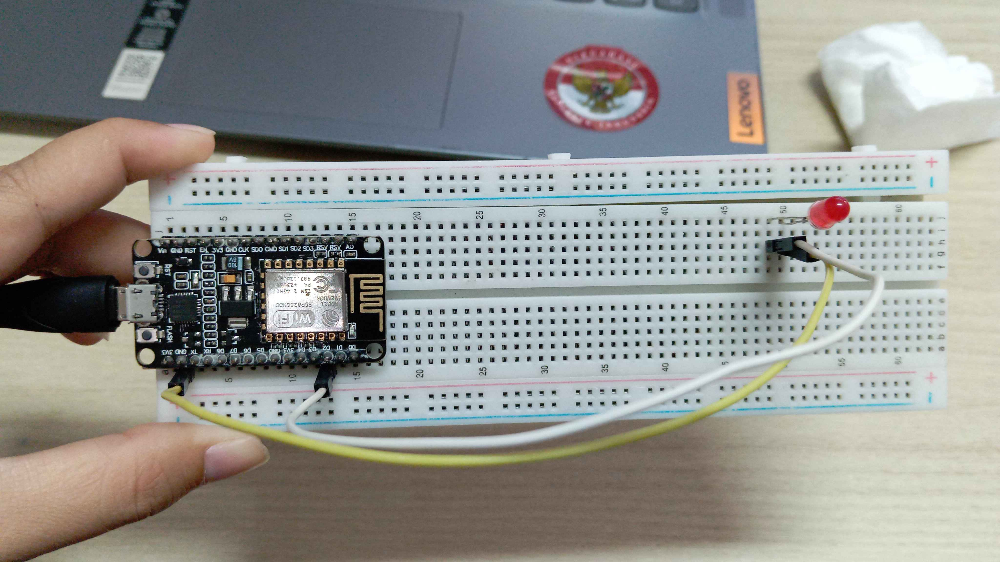
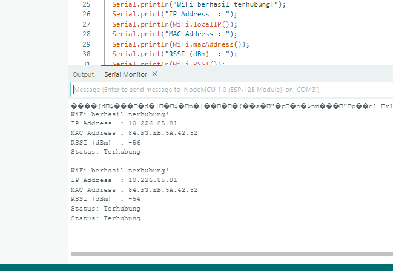
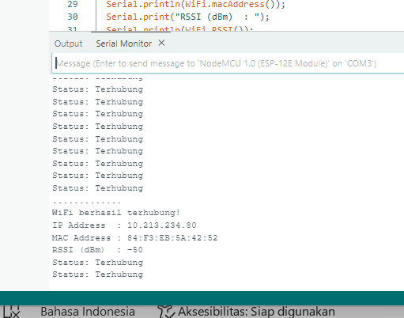
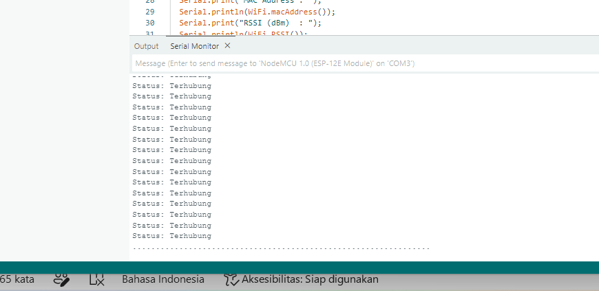
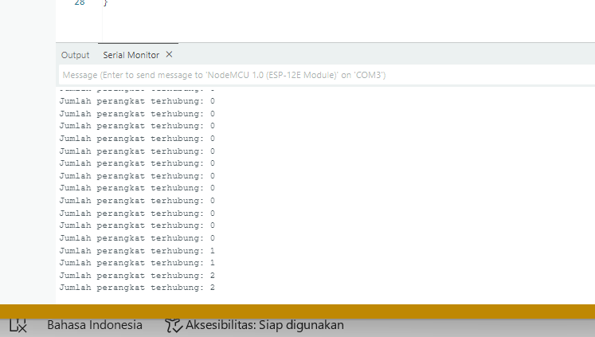

# Pertemuan 2 - Konfigurasi Jaringan

## Tujuan dan Penjelasan Singkat
Praktikum pada Pertemuan 2 ini berfokus pada implementasi konfigurasi jaringan nirkabel (WiFi) menggunakan mikrokontroler ESP8266:
1. Konsep Jaringan Nirkabel IoT: Memahami mekanisme kerja konektivitas WiFi pada arsitektur sistem berbasis IoT.
2. Mode Operasi WiFi: Menganalisis cara kerja dan perbedaan mendasar antara mode Station (STA), Access Point (AP), dan mode kombinasi (AP+STA) pada modul ESP8266.
3. Konfigurasi Mode Station (STA): Menghubungkan ESP8266 ke jaringan infrastruktur (*Local Area Network* / router) yang sudah ada serta membaca parameter jaringan seperti IP Address, MAC Address, dan kekuatan sinyal (*Received Signal Strength Indicator* / RSSI).
4. Konfigurasi Mode Access Point (AP): Mengonfigurasi ESP8266 agar bertindak sebagai penyedia jaringan mandiri (*softAP*) yang mampu melayani koneksi perangkat luar (*client*) dan memantau jumlah perangkat yang terhubung.
5. Penanganan Galat dan Mode Ganda: Mengembangkan mekanisme pemulihan koneksi otomatis (*auto-reconnect*) dan mengimplementasikan mode ganda AP+STA secara simultan.

## Peralatan yang Diperlukan
<div align="center">
<table border="1" cellpadding="10" cellspacing="0" width="100%">
  <tr align="center">
    <th>ESP8266</th>
    <th>Breadboard</th>
    <th>Kabel Jumper</th>
    <th>LED</th>
    <th>Kabel USB Type B</th>
    <th>Arduino IDE</th>
  </tr>

  <tr align="center">
    <td>
      <br>
    </td>
    <td>
      <br>
    </td>
    <td>
      <br>
    </td>
    <td>
      <br>
    </td>
    <td>
      <br>
    </td>
    <td>
      <br>
    </td>
  </tr>
</table>
</div>

## Percobaan 2A
### Gambaran Umum 
Percobaan 2A bertujuan untuk mengimplementasikan ESP8266 sebagai *Station* (STA), yaitu bertindak sebagai perangkat klien yang mencari dan menghubungkan diri ke jaringan WiFi lokal yang telah tersedia. Program melakukan autentikasi menggunakan SSID dan password yang ditentukan. Ketika proses sambungan berhasil, sistem memperoleh konfigurasi jaringan dinamis dari server DHCP lokal, menampilkan alamat IP, MAC address, serta nilai RSSI ke Serial Monitor, dan menyalakan LED indikator pada pin GPIO 2 sebagai umpan balik visual. Status koneksi kemudian dipantau secara periodik setiap 5 detik.

### Skematik Percobaan
```
[ ESP8266 GPIO 2 ] ------------------------- [ Anoda (+) LED ]
[ ESP8266 GND ] --------------------------- [ Katoda (-) LED ]
```

### Kode Program
```cpp
#include <WiFi.h>

const char* ssid     = "NAMA_WIFI_ANDA";
const char* password = "PASSWORD_WIFI_ANDA";

const int ledPin = 2; 

void setup() {
  Serial.begin(115200);
  pinMode(ledPin, OUTPUT);
  digitalWrite(ledPin, LOW);

  WiFi.mode(WIFI_STA);
  WiFi.begin(ssid, password);

  Serial.print("Menghubungkan ke WiFi");
  while (WiFi.status() != WL_CONNECTED) {
    delay(500);
    Serial.print(".");
  }

  Serial.println();
  Serial.println("WiFi berhasil terhubung!");
  Serial.print("IP Address  : ");
  Serial.println(WiFi.localIP());
  Serial.print("MAC Address : ");
  Serial.println(WiFi.macAddress());
  Serial.print("RSSI (dBm)  : ");
  Serial.println(WiFi.RSSI());

  digitalWrite(ledPin, HIGH); 
}

void loop() {
  if (WiFi.status() == WL_CONNECTED) {
    Serial.println("Status: Terhubung");
  } else {
    Serial.println("Status: Terputus");
    digitalWrite(ledPin, LOW);
  }
  delay(5000);
}
```

### Penjelasan Kode per Baris Fungsi
1. `#include <WiFi.h>` : Mengimpor pustaka bawaan ESP8266 untuk mengontrol fungsi perangkat keras radio WiFi, tumpukan protokol TCP/IP, dan manajemen koneksi.
2. `const char* ssid = "...";` & `const char* password = "...";` : Mendeklarasikan variabel konstanta string yang menyimpan nama jaringan (SSID) dan kata sandi WiFi target.
3. `const int ledPin = 2;` : Menetapkan nomor pin GPIO 2 (LED internal/eksternal) sebagai indikator visual status koneksi jaringan.
4. `void setup() { ... }` : Fungsi inisialisasi awal yang dijalankan satu kali saat mikrokontroler menyala:
    - `Serial.begin(115200);` : Mengaktifkan komunikasi serial dengan baud rate 115200 bps untuk transmisi log debugging ke Serial Monitor.
    - `pinMode(ledPin, OUTPUT);` : Mengonfigurasi pin GPIO 2 sebagai jalur keluaran digital.
    - `digitalWrite(ledPin, LOW);` : Memastikan LED dalam kondisi mati di awal program.
    - `WiFi.mode(WIFI_STA);` : Menyetel modul radio WiFi ke mode *Station* (klien nirkabel).
    - `WiFi.begin(ssid, password);` : Memulai prosedur negosiasi sambungan ke router sesuai kredensial yang ditentukan.
    - `while (WiFi.status() != WL_CONNECTED) { ... }` : Perulangan yang menahan eksekusi program selama ESP8266 belum berhasil mendapatkan status terhubung (`WL_CONNECTED`), dengan mencetak tanda titik setiap 500 ms.
    - `WiFi.localIP()` : Mengambil alamat IP lokal yang dialokasikan oleh router ke ESP8266.
    - `WiFi.macAddress()` : Membaca identitas fisik unik kartu jaringan (*Physical Address*) ESP8266.
    - `WiFi.RSSI()` : Mengukur intensitas kekuatan sinyal radio WiFi yang diterima dalam satuan dBm.
    - `digitalWrite(ledPin, HIGH);` : Mengirim sinyal logika HIGH ke GPIO 2 untuk menyalakan LED tanda koneksi aktif.
5. `void loop() { ... }` : Siklus utama program yang berjalan terus-menerus:
    - `if (WiFi.status() == WL_CONNECTED)` : Melakukan evaluasi berkala untuk memastikan modul masih tersambung ke router.
    - `else { digitalWrite(ledPin, LOW); }` : Mematikan LED dan menampilkan status terputus apabila sambungan terputus.
    - `delay(5000);` : Mengatur interval waktu pengecekan status jaringan setiap 5 detik.

### Library/Dependencies yang Dibutuhkan
1. `WiFi.h` (Pustaka internal ESP8266 Core).
2. Board Support Package ESP8266 pada Arduino IDE Boards Manager.

### Pertanyaan Praktikum
1. Gambarkan diagram alur (flowchart) proses koneksi ESP8266 ke jaringan WiFi pada program di atas!
2. Apa fungsi dari perintah `WiFi.mode(WIFI_STA)` pada program tersebut?
3. Jelaskan apa yang terjadi apabila SSID atau password yang dimasukkan salah!
4. Modifikasi program agar ESP8266 mencoba menghubungkan ulang (reconnect) secara otomatis apabila koneksi WiFi terputus, dan berikan penjelasan di setiap baris kode yang ditambahkan!

### Jawaban Praktikum
1. Diagram Alur (Flowchart) Proses Akuisisi Data Sensor
<div align="center">
  
</div>

2. Perintah `WiFi.mode(WIFI_STA)` berfungsi mengonfigurasi modul radio WiFi internal ESP8266 agar beroperasi penuh sebagai **Station (STA)**. Dalam mode ini, ESP8266 bertindak murni sebagai perangkat klien nirkabel—serupa dengan smartphone atau laptop—yang bertugas mencari, mengautentikasi, dan tersambung ke jaringan lokal melalui titik akses (Access Point/router) yang sudah ada. Perintah ini sekaligus menonaktifkan fungsi *soft Access Point* mandiri (`WIFI_AP`) sehingga ESP8266 tidak memancarkan SSID sendiri dan dapat menerima alokasi alamat IP melalui DHCP router.
3. Apabila kredensial salah, sistem akan mengalami beberapa hal:
    - Terjebak pada Infinite Blocking Loop: Program tertahan tanpa batas waktu di dalam perulangan `while (WiFi.status() != WL_CONNECTED)` pada `setup()` karena status tidak pernah mencapai kondisi berhasil.
    - Serial Monitor Mencetak Titik Berulang: Output serial terus menampilkan deretan tanda titik `..........` setiap 500 ms tanpa henti.
    - LED Indikator Tetap Padam: Baris instruksi `digitalWrite(ledPin, HIGH)` berada setelah blok loop penantian, sehingga tidak akan pernah dieksekusi.
    - Fungsi `loop()` Tidak Berjalan: Karena terhenti di fungsi `setup()`, mikrokontroler tidak pernah mengeksekusi blok pemantauan berkala pada `void loop()`.
4. Modifikasi Program
```cpp
#include <WiFi.h>

const char* ssid     = "NAMA_WIFI_ANDA";
const char* password = "PASSWORD_WIFI_ANDA";

const int ledPin = 2; // LED indikator status koneksi

void setup() {
  Serial.begin(115200);
  pinMode(ledPin, OUTPUT);
  digitalWrite(ledPin, LOW);

  // Set mode WiFi menjadi Station
  WiFi.mode(WIFI_STA);
  WiFi.begin(ssid, password);

  Serial.print("Menghubungkan ke WiFi");
  while (WiFi.status() != WL_CONNECTED) {
    delay(500);
    Serial.print(".");
  }

  // Jika berhasil terhubung
  Serial.println();
  Serial.println("WiFi berhasil terhubung!");
  Serial.print("IP Address  : ");
  Serial.println(WiFi.localIP());
  Serial.print("MAC Address : ");
  Serial.println(WiFi.macAddress());
  Serial.print("RSSI (dBm)  : ");
  Serial.println(WiFi.RSSI());

  digitalWrite(ledPin, HIGH); // nyalakan LED sebagai indikator
}

void loop() {
  // Cek status koneksi setiap 5 detik
  if (WiFi.status() == WL_CONNECTED) {
    Serial.println("Status: Terhubung");
    digitalWrite(ledPin, HIGH);
  } else {
    Serial.println("Status: Terputus! Mencoba reconnect...");
    digitalWrite(ledPin, LOW);
    
    // Memutus sesi lama dan memulai rekoneksi
    WiFi.disconnect();
    WiFi.reconnect();
    
    // Menunggu koneksi pulih maksimal 10 detik
    unsigned long startAttempt = millis();
    while (WiFi.status() != WL_CONNECTED && millis() - startAttempt < 10000) {
      delay(500);
      Serial.print(".");
    }
    
    if (WiFi.status() == WL_CONNECTED) {
      Serial.println("\nWiFi berhasil terhubung kembali!");
      Serial.print("IP Address  : ");
      Serial.println(WiFi.localIP());
      digitalWrite(ledPin, HIGH);
    } else {
      Serial.println("\nGagal reconnect, mencoba lagi pada siklus berikutnya.");
    }
  }
  delay(5000);
}
```

#### Penjelasan Baris Kode Modifikasi:
- `digitalWrite(ledPin, HIGH);` *(pada blok `if (WiFi.status() == WL_CONNECTED)`)* : Memastikan LED menyala kembali ketika koneksi jaringan yang sebelumnya drop telah kembali normal.
- `Serial.println("Status: Terputus! Mencoba reconnect...");` : Menampilkan informasi ke Serial Monitor bahwa sambungan terputus dan proses pemulihan sedang berjalan.
- `WiFi.disconnect();` : Membersihkan buffer jaringan, memutus tumpukan sesi soket TCP/IP lama, dan mereset status radio WiFi.
- `WiFi.reconnect();` : Memerintahkan modul ESP8266 mengulang proses jabat tangan (*handshake*) ke router dengan kredensial yang tersimpan.
- `unsigned long startAttempt = millis();` : Menyimpan waktu acuan awal penantian dalam milidetik guna menerapkan mekanisme batas waktu (*timeout*).
- `while (WiFi.status() != WL_CONNECTED && millis() - startAttempt < 10000)` : Memberikan toleransi waktu rekoneksi hingga maksimal 10 detik agar loop tidak membeku selamanya (*non-blocking loop*).
- `if (WiFi.status() == WL_CONNECTED) { ... } else { ... }` : Mengevaluasi hasil percobaan; memperbarui tampilan IP dan menyalakan LED jika berhasil, atau memberi peringatan gagal jika batas toleransi habis untuk dicoba lagi pada siklus berikutnya.

### Dokumentasi
<div align="center">
<table border="1" cellpadding="10" cellspacing="0" width="100%">
    <td>
      <br>
    </td>
    <td>
      <br>
    </td>
    <td>
      <br>
    </td>
    <td>
      <br>
    </td>
  </tr>
</table>
</div>

## Percobaan 2B
### Gambaran Umum 
Percobaan 2B mengimplementasikan ESP8266 sebagai *Soft Access Point* (AP) mandiri tanpa bantuan router eksternal. Mikrokontroler memancarkan jaringan nirkabel (*hotspot*) dengan SSID dan kata sandi yang dikonfigurasi secara independen. ESP8266 mengalokasikan subnet lokalnya sendiri melalui antarmuka gateway `192.168.4.1`. Perangkat klien (smartphone atau PC) dapat mendeteksi serta terhubung ke jaringan tersebut. Mikrokontroler menjalankan fungsi `WiFi.softAPgetStationNum()` di dalam fungsi `loop()` untuk memantau dan menampilkan jumlah stasiun/klien yang aktif tersambung secara berkala.

### Skematik Percobaan
```
[ ESP8266 Board Mandiri ] <--- (Koneksi USB / VCC 5V)
           ) ) ) [ Gelombang Radio WiFi 2.4 GHz SoftAP ] ( ( (
[ Perangkat Klien 1 (Smartphone) ]          [ Perangkat Klien 2 (Laptop) ]
```

### Kode Program
```cpp
#include <WiFi.h>

const char* ap_ssid     = "ESP32_Access Point";
const char* ap_password = "12345678"; 

void setup() {
  Serial.begin(115200);

  WiFi.mode(WIFI_AP);
  WiFi.softAP(ap_ssid, ap_password);

  IPAddress apIP = WiFi.softAPIP();

  Serial.println("Access Point aktif!");
  Serial.print("SSID       : ");
  Serial.println(ap_ssid);
  Serial.print("IP Address : ");
  Serial.println(apIP);
}

void loop() {
  int jumlahClient = WiFi.softAPgetStationNum();
  Serial.print("Jumlah perangkat terhubung: ");
  Serial.println(jumlahClient);
  delay(5000);
}
```

### Penjelasan Kode per Baris Fungsi
1. `#include <WiFi.h>` : Mengimpor pustaka dasar antarmuka jaringan WiFi ESP8266.
2. `const char* ap_ssid = "...";` : Menentukan nama SSID hotspot yang disiarkan oleh ESP8266.
3. `const char* ap_password = "...";` : Menentukan kunci keamanan jaringan WPA2-PSK (minimal 8 karakter).
4. `void setup() { ... }` : Inisialisasi awal sistem Access Point:
    - `Serial.begin(115200);` : Mengaktifkan port serial komunikasi komputer pada baud rate 115200 bps.
    - `WiFi.mode(WIFI_AP);` : Menyetel fungsi radio ESP8266 menjadi mode pemancar Access Point saja.
    - `WiFi.softAP(ap_ssid, ap_password);` : Mengaktifkan radio SoftAP dengan nama jaringan dan enkripsi yang telah disiapkan.
    - `IPAddress apIP = WiFi.softAPIP();` : Membaca alamat IP gateway milik Access Point ESP8266 (standar: `192.168.4.1`).
    - `Serial.print(...)` : Menampilkan informasi status AP aktif, nama SSID, dan IP gateway ke Serial Monitor.
5. `void loop() { ... }` : Monitoring koneksi klien berkala:
    - `int jumlahClient = WiFi.softAPgetStationNum();` : Memanggil fungsi sistem internal ESP8266 untuk menghitung jumlah stasiun klien yang saat ini mengantongi izin sewa IP DHCP aktif.
    - `Serial.println(jumlahClient);` : Menampilkan angka total klien yang terhubung ke Serial Monitor.
    - `delay(5000);` : Memberikan interval pembacaan setiap 5 detik.

### Library/Dependencies yang Dibutuhkan
1. `WiFi.h` (Pustaka internal ESP8266 Core).
2. Board Support Package ESP8266 pada Arduino IDE Boards Manager.

### Pertanyaan Praktikum
1. Mengapa alamat IP default Access Point pada ESP8266 umumnya bernilai `192.168.4.1`?
2. Apa perbedaan mendasar antara mode Station dan mode Access Point pada ESP8266?
3. Jelaskan risiko keamanan apabila password Access Point tidak diberikan atau terlalu sederhana!
4. Modifikasi program agar ESP8266 berjalan pada mode AP+STA (terhubung ke WiFi rumah sekaligus menyediakan Access Point), dan berikan penjelasan di setiap baris kodenya!

### Jawaban Praktikum
1. Alamat IP `192.168.4.1` ditetapkan secara standar pada *stack* protokol jaringan TCP/IP (*LwIP*) ESP-IDF karena berada dalam blok IP privat kelas C (RFC 1918) yang aman untuk jaringan lokal tertutup. Penetapan subnet ke-4 (`192.168.4.0/24`) ini bertujuan untuk mencegah tabrakan subnet (*subnet collision*) dengan jaringan router rumah atau tethering seluler yang umumnya memakai subnet `192.168.0.x` atau `192.168.1.x`, sehingga mode ganda AP+STA dapat bekerja secara berdampingan tanpa konflik tabel perutean. Di samping itu, IP berakhiran `.1` menandakan peran ESP8266 sebagai gerbang utama (*gateway*) sekaligus server DHCP lokal.
2. Perbedaan mendasar antara kedua mode tersebut terletak pada perannya dalam topologi jaringan: pada mode **Station (STA)**, ESP8266 bertindak murni sebagai klien nirkabel pasif yang terhubung ke jaringan luar (seperti router atau hotspot) serta menerima alokasi alamat IP melalui server DHCP eksternal guna mengakses internet maupun server *cloud*, sedangkan pada mode **Access Point (AP)**, ESP8266 justru bertindak mandiri sebagai penyedia jaringan (*hotspot*) yang aktif memancarkan SSID miliknya sendiri, menjalankan server DHCP internal untuk membagikan IP kepada perangkat yang terhubung dengannya, serta tidak memerlukan router eksternal karena umumnya dimanfaatkan untuk konfigurasi awal perangkat (*provisioning*) atau komunikasi data lokal secara *peer-to-peer*.
3. Risiko Keamanan Password AP Terlalu Sederhana / Tanpa Password:
    - **Akses Tanpa Izin (*Unauthorized Access*)**: Pihak lain dapat dengan mudah terhubung ke jaringan mikrokontroler baik secara langsung maupun melalui serangan *brute force* bila kata sandi lemah.
    - **Manipulasi Konfigurasi dan Aktuator**: Jika ESP8266 mengoperasikan server web lokal, pihak luar yang tersambung dapat mengakses endpoint kontrol untuk menyalakan/mematikan aktuator atau mengubah konfigurasi sistem tanpa izin.
    - **Kelumpuhan Jaringan (*Denial of Service*)**: Modul SoftAP ESP8266 memiliki kapasitas klien terbatas (umumnya 4-10 klien). Perangkat asing yang membanjiri koneksi akan menghabiskan memori internal (SRAM) dan kuota sambungan, menyebabkan ESP8266 mengalami *crash* atau menolak perangkat yang sah.
    - **Penyadapan Data (*Eavesdropping*)**: Komunikasi data lokal yang tidak diproteksi enkripsi kuat berisiko ditangkap (*sniffing*) oleh perangkat lain pada saluran radio yang sama.
4. Program Modifikasi
```cpp
#include <WiFi.h>

// Kredensial untuk terhubung ke Router/WiFi (Mode STA)
const char* sta_ssid     = "WiFi_Rumah";
const char* sta_password = "PasswordWiFiRumah";

// Kredensial untuk Access Point yang dipancarkan ESP8266 (Mode AP)
const char* ap_ssid      = "ESP8266_DualMode_AP";
const char* ap_password  = "12345678"; // Minimal 8 karakter

const int ledPin = 2; // LED indikator status STA

void setup() {
  Serial.begin(115200);
  pinMode(ledPin, OUTPUT);
  digitalWrite(ledPin, LOW);

  // 1. Mengaktifkan mode ganda (AP + Station)
  WiFi.mode(WIFI_AP_STA);

  // 2. Mengaktifkan konfigurasi Access Point (SoftAP)
  WiFi.softAP(ap_ssid, ap_password);
  Serial.println("\n=== Access Point Aktif ===");
  Serial.print("SSID AP    : ");
  Serial.println(ap_ssid);
  Serial.print("IP Address : ");
  Serial.println(WiFi.softAPIP());

  // 3. Memulai koneksi ke WiFi Router (Station)
  WiFi.begin(sta_ssid, sta_password);
  Serial.println("\n=== Menghubungkan ke WiFi (STA) ===");
  
  unsigned long startAttempt = millis();
  // Tunggu koneksi STA hingga 15 detik (non-blocking permanen)
  while (WiFi.status() != WL_CONNECTED && millis() - startAttempt < 15000) {
    delay(500);
    Serial.print(".");
  }
  Serial.println();

  if (WiFi.status() == WL_CONNECTED) {
    Serial.println("STA Berhasil Terhubung ke Router!");
    Serial.print("IP STA     : ");
    Serial.println(WiFi.localIP());
    Serial.print("MAC STA    : ");
    Serial.println(WiFi.macAddress());
    Serial.print("RSSI (dBm) : ");
    Serial.println(WiFi.RSSI());
    digitalWrite(ledPin, HIGH);
  } else {
    Serial.println("STA Gagal Terhubung ke Router (Timeout). SoftAP tetap beroperasi.");
  }
}

void loop() {
  Serial.println("\n--- Pemantauan Jaringan Berkala (5 detik) ---");

  // Monitoring Klien di Access Point
  int jumlahClient = WiFi.softAPgetStationNum();
  Serial.print("AP Client Terhubung : ");
  Serial.println(jumlahClient);

  // Monitoring Status Koneksi Station (STA)
  if (WiFi.status() == WL_CONNECTED) {
    Serial.println("Status STA          : Terhubung");
    digitalWrite(ledPin, HIGH);
  } else {
    Serial.println("Status STA          : Terputus / Mencoba Reconnect...");
    digitalWrite(ledPin, LOW);
    WiFi.reconnect();
  }

  delay(5000);
}
```

#### Penjelasan Baris Kode Modifikasi:
- `const char* sta_ssid` & `const char* sta_password` : Mendeklarasikan kredensial jaringan eksternal/router rumah yang akan dihubungi antarmuka Station.
- `const char* ap_ssid` & `const char* ap_password` : Mendefinisikan identitas SSID dan kunci pengaman dari hotspot mandiri yang dipancarkan ESP8266.
- `WiFi.mode(WIFI_AP_STA);` : Mengaktifkan antarmuka ganda (*dual interface*) pada radio ESP8266 agar dapat menjalankan mode Station dan Access Point secara bersamaan.
- `WiFi.softAP(ap_ssid, ap_password);` : Mengaktifkan jaringan hotspot mandiri dan menjalankan server DHCP lokal.
- `WiFi.begin(sta_ssid, sta_password);` : Memulai permintaan sambungan klien ke router target.
- `unsigned long startAttempt = millis();` : Merekam waktu awal koneksi untuk menetapkan batas penantian sambungan STA.
- `while (WiFi.status() != WL_CONNECTED && millis() - startAttempt < 15000)` : Mencegah mikrokontroler tertahan permanen (*infinite loop*) jika router mati, sehingga penantian dibatasi maksimal 15 detik dan layanan AP lokal tetap dapat dipakai.
- `digitalWrite(ledPin, HIGH);` : Memberikan konfirmasi visual menyala jika antarmuka STA berhasil tersambung ke router eksternal.
- `int jumlahClient = WiFi.softAPgetStationNum();` : Menghitung dan menampilkan total perangkat yang terhubung ke jaringan SoftAP ESP8266.
- `WiFi.reconnect();` : Memulihkan sambungan STA ke router target secara mandiri saat koneksi terputus di tengah jalan tanpa mereset Access Point.

### Dokumentasi
<div align="center">
<table border="1" cellpadding="10" cellspacing="0" width="100%">
    <td>
      <br>
    </td>
    <td>
      <br>
    </td>
  </tr>
</table>
</div>