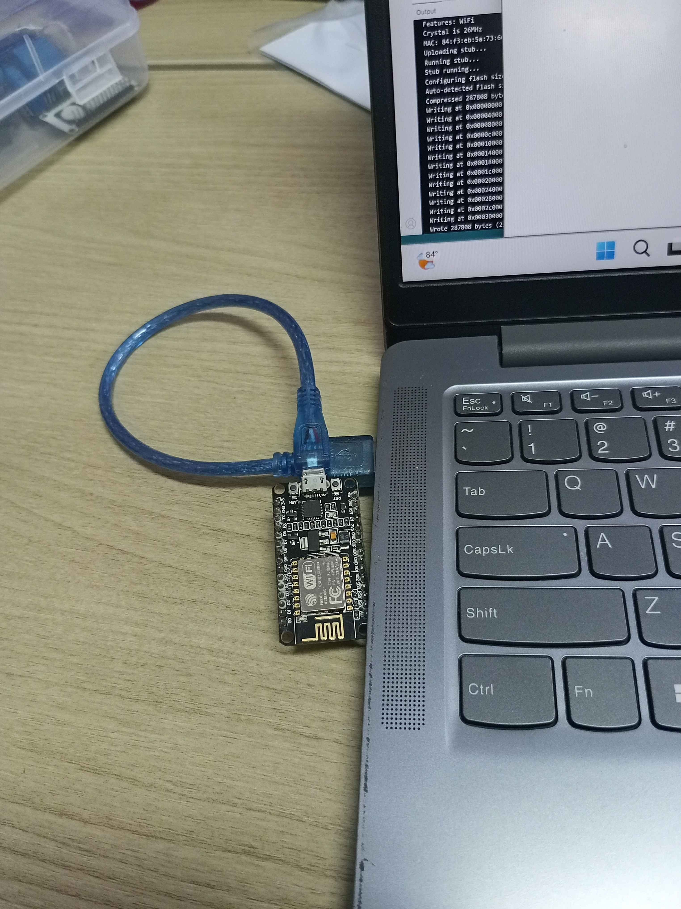
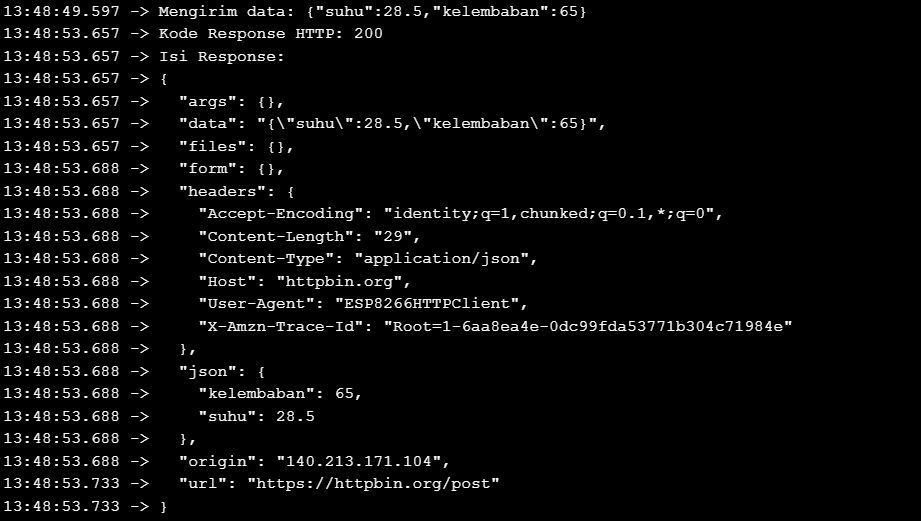
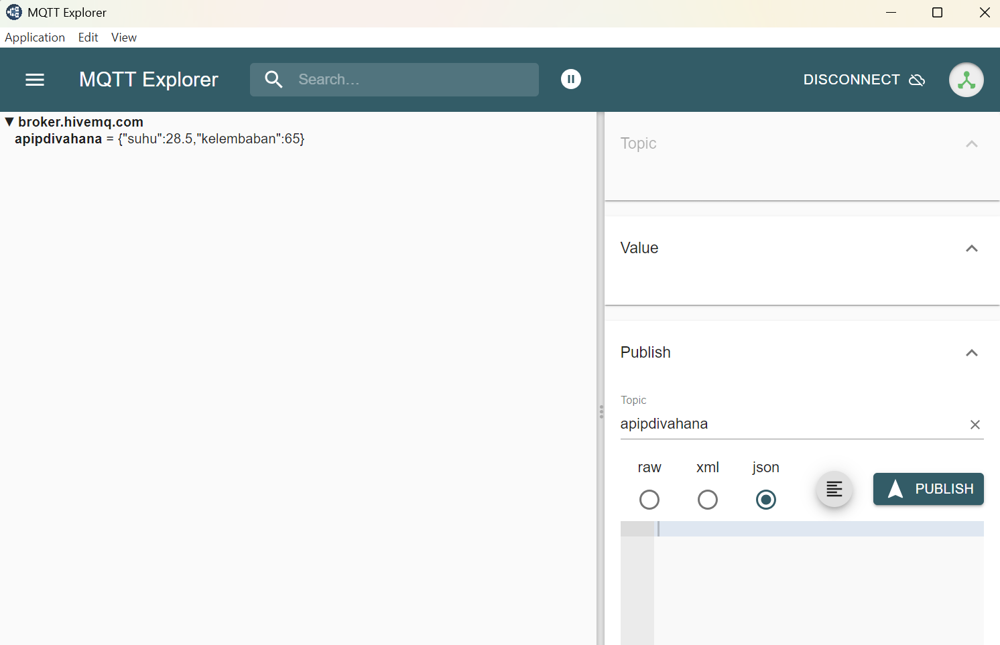
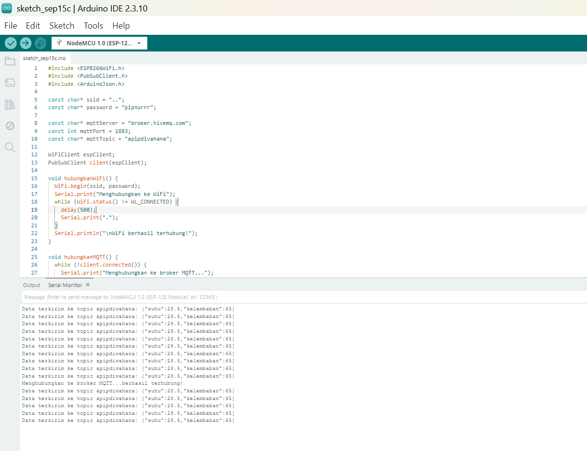

# Pertemuan 3 - Protokol Komunikasi

## Tujuan dan Penjelasan Singkat
Praktikum pada Pertemuan 3 ini berfokus pada implementasi dan analisis protokol komunikasi data pada sistem berbasis IoT:
1. Konsep Dasar Protokol Komunikasi IoT: Memahami mekanisme dasar pertukaran data telemetri antara node mikrokontroler dengan peladen (server) atau perantara (broker).
2. Karakteristik HTTP vs. MQTT: Menganalisis perbedaan mendasar antara protokol HTTP (metode POST) dan protokol MQTT (Publish-Subscribe) dalam konteks IoT.
3. Implementasi HTTP POST: Mengirimkan data sensor dari ESP8266 ke server HTTP dalam format JSON melalui metode POST.
4. Implementasi MQTT Publish: Mempublikasikan data sensor secara terstruktur menggunakan format JSON ke broker MQTT dengan pola Publish-Subscribe.
5. Analisis Skenario Aplikasi: Memahami kelebihan dan kekurangan masing-masing protokol untuk berbagai kebutuhan arsitektur IoT.  

## Peralatan yang Diperlukan
<div align="center">
<table border="1" cellpadding="10" cellspacing="0" width="100%">
  <tr align="center">
    <th>ESP8266</th>
    <th>Kabel Micro USB</th>
    <th>Arduino IDE</th>
  </tr>

  <tr align="center">
    <td>
      <br>
    </td>
    </td>
    <td>
      <br>
    </td>
    <td>
      <br>
    </td>
  </tr>
</table>
</div>

## Percobaan 3A
### Gambaran Umum 
Percobaan 3A bertujuan untuk mengimplementasikan pengiriman data telemetri dari ESP8266 ke server melalui protokol HTTP dengan metode POST. Data dummy berupa suhu dan kelembaban dikonstruksi ke dalam struktur JSON menggunakan pustaka ArduinoJson. Data diserialisasi menjadi teks string, lalu dikirimkan ke endpoint uji [https://httpbin.org/post] menggunakan pustaka ESP8266HTTPClient dan WiFiClientSecure. Pengiriman dilakukan secara berkala dengan interval 10 detik.

### Skematik Percobaan
```
[ ESP8266 NodeMCU ] <--- (Koneksi USB / Power)
          │
     (WiFi / TCP)
          │
          ▼
[ Router / Access Point ] -> Hp / Laptop
          │
      (Internet)
          │
          ▼
[ HTTP Server (httpbin.org/post) ]
```

### Kode Program
```cpp
#include <ESP8266WiFi.h>
#include <ESP8266HTTPClient.h>
#include <WiFiClientSecure.h>
#include <ArduinoJson.h>

const char* ssid = "..";
const char* password = "pipnurrr";
const char* serverUrl = "https://httpbin.org/post"; // endpoint uji HTTP POST

void setup() {
  Serial.begin(115200);
  WiFi.begin(ssid, password);
  Serial.print("Menghubungkan ke WiFi");
  while (WiFi.status() != WL_CONNECTED) {
    delay(500);
    Serial.print(".");
  }
  Serial.println();
  Serial.println("WiFi berhasil terhubung!");
}

void loop() {
  if (WiFi.status() == WL_CONNECTED) {
    WiFiClientSecure client;
    client.setInsecure();
    HTTPClient http;
    http.begin(client, serverUrl);
    http.addHeader("Content-Type", "application/json");

    // Membuat objek data sensor dalam format JSON
    JsonDocument doc;
    doc["suhu"] = 28.5; // contoh data suhu (°C)
    doc["kelembaban"] = 65.0; // contoh data kelembaban (%)

    String requestBody;
    serializeJson(doc, requestBody);

    Serial.print("Mengirim data: ");
    Serial.println(requestBody);

    // Mengirim data melalui HTTP POST
    int httpResponseCode = http.POST(requestBody);

    if (httpResponseCode > 0) {
      Serial.print("Kode Response HTTP: ");
      Serial.println(httpResponseCode);
      Serial.println("Isi Response:");
      Serial.println(http.getString());
    } else {
      Serial.print("Pengiriman gagal, kode error: ");
      Serial.println(httpResponseCode);
    }
    http.end();
  }
  delay(10000); // kirim data setiap 10 detik
}
```

### Penjelasan Kode per Baris Fungsi
1. `#include <ESP8266WiFi.h>` : Mengimpor pustaka utama untuk mengelola koneksi radio WiFi pada ESP8266.
2. `#include <ESP8266HTTPClient.h>` : Mengimpor pustaka klien HTTP untuk membuat dan mengirimkan permintaan HTTP/HTTPS.
3. `#include <WiFiClientSecure.h>` : Mengimpor pustaka klien jaringan dengan dukungan lapisan keamanan SSL/TLS.
4. `#include <ArduinoJson.h>` : Mengimpor pustaka untuk membuat, mengolah, dan memanipulasi objek data JSON.
5. `const char* ssid & const char* password` : Mendefinisikan nama jaringan WiFi target dan kata sandi untuk autentikasi.
6. `const char* serverUrl` : Menyimpan alamat URL endpoint server uji target.
7. `void setup() { ... }` :
    - `Serial.begin(115200);` : Mengaktifkan port komunikasi serial dengan kecepatan transfer 115200 bps.
    - `WiFi.begin(ssid, password);` : Memulai prosedur koneksi nirkabel ke router.
    - `while (WiFi.status() != WL_CONNECTED)` : Menahan eksekusi program hingga ESP8266 resmi memperoleh koneksi IP.
8. `void loop() { ... }` :
    - `if (WiFi.status() == WL_CONNECTED)` : Memastikan ketersediaan jaringan sebelum memulai transaksi HTTP.
    - `WiFiClientSecure client; client.setInsecure();` : Menyiapkan klien jaringan aman dan mengabaikan verifikasi sertifikat SSL root untuk mempermudah koneksi HTTPS.
    - `HTTPClient http; http.begin(client, serverUrl);` : Menginisialisasi objek klien HTTP dengan konfigurasi endpoint target.
    - `http.addHeader("Content-Type", "application/json");` : Menyisipkan metadata header yang menyatakan bahwa body permintaan berformat JSON.
    - `JsonDocument doc; doc["suhu"] = 28.5; ...` : Membuat dokumen JSON dan mengisi variabel parameter suhu serta kelembaban.
    - `serializeJson(doc, requestBody);` : Mengonversi objek JSON ke dalam bentuk string teks.
    - `int httpResponseCode = http.POST(requestBody);` : Mengeksekusi permintaan HTTP POST dengan membawa payload data JSON dan menerima kode respon balik dari server.
    - `http.end();` : Menutup koneksi HTTP untuk membebaskan sumber daya memori mikrokontroler.   
    - `delay(10000);` : Menunda siklus pengiriman berikutnya selama 10 detik. 

### Library/Dependencies yang Dibutuhkan
1. ESP8266WiFi.h (Pustaka internal ESP8266 Core).
2. ESP8266HTTPClient.h (Pustaka internal ESP8266 Core).
3. WiFiClientSecure.h (Pustaka internal ESP8266 Core).
4. ArduinoJson oleh Benoit Blanchon (versi 6/7). 

### Pertanyaan Praktikum
1. Gambarkan diagram alur (flowchart) proses pengiriman data melalui HTTP POST pada program di atas!
2. Apa fungsi dari perintah http.addHeader("Content-Type", "application/json") pada program tersebut?
3. Jelaskan arti dari kode response HTTP 200 dan sebutkan salah satu contoh kode response HTTP lain beserta artinya!
4. Modifikasi program agar ESP8266 dapat mengirimkan data tambahan berupa waktu (dalam milidetik sejak dinyalakan menggunakan millis()) ke dalam JSON yang dikirim, dan berikan penjelasan di setiap baris kode yang ditambahkan dalam bentuk README.md   

### Jawaban Praktikum
1. Diagram Alur (Flowchart) Proses Pengiriman Data HTTP POST
<div align="center">
  
</div>

2. Perintah http.addHeader("Content-Type", "application/json") berfungsi menyisipkan metadata pada header HTTP yang menginformasikan kepada server penerima bahwa data di dalam request body dikirimkan dalam format JSON (application/json). Tanpa header ini, server secara default dapat menganggap data kiriman sebagai plain text (text/plain) atau form-urlencoded, sehingga server tidak mem-parsing teks tersebut menjadi objek JSON yang valid dan berpotensi memicu kode status galat seperti 400 Bad Request atau 415 Unsupported Media Type.
3. Kode respon HTTP:
    - HTTP 200 (OK): Menandakan bahwa request dari klien berhasil diterima, dipahami, dan diproses oleh server secara sukses. Pada metode POST, respon 200 umumnya disertai data kembalian (response body) yang memuat hasil pemrosesan data.
    - HTTP 404 (Not Found): Menunjukkan bahwa server tidak dapat menemukan endpoint atau sumber daya pada URL yang dituju oleh klien akibat kesalahan penulisan path URL.
    - HTTP 400 (Bad Request): Menunjukkan bahwa server tidak dapat memproses request karena kesalahan sintaksis atau struktur data dari sisi klien.
4. Program Modifikasi
```cpp
#include <ESP8266WiFi.h>
#include <ESP8266HTTPClient.h>
#include <WiFiClientSecure.h>
#include <ArduinoJson.h>

const char* ssid = "..";
const char* password = "pipnurrr";
const char* serverUrl = "https://httpbin.org/post"; // endpoint uji HTTP POST

void setup() {
  Serial.begin(115200);
  WiFi.begin(ssid, password);
  Serial.print("Menghubungkan ke WiFi");
  while (WiFi.status() != WL_CONNECTED) {
    delay(500);
    Serial.print(".");
  }
  Serial.println();
  Serial.println("WiFi berhasil terhubung!");
}

void loop() {
  if (WiFi.status() == WL_CONNECTED) {
    WiFiClientSecure client;
    client.setInsecure();
    HTTPClient http;
    http.begin(client, serverUrl);
    http.addHeader("Content-Type", "application/json");

    // Membuat objek data sensor dalam format JSON
    JsonDocument doc;
    doc["suhu"] = 28.5;       // contoh data suhu (°C)
    doc["kelembaban"] = 65.0; // contoh data kelembaban (%)
    doc["waktu"] = millis();  // DATA TAMBAHAN: waktu operasional ESP8266 dalam milidetik

    String requestBody;
    serializeJson(doc, requestBody);

    Serial.print("Mengirim data: ");
    Serial.println(requestBody);

    // Mengirim data melalui HTTP POST
    int httpResponseCode = http.POST(requestBody);

    if (httpResponseCode > 0) {
      Serial.print("Kode Response HTTP: ");
      Serial.println(httpResponseCode);
      Serial.println("Isi Response:");
      Serial.println(http.getString());
    } else {
      Serial.print("Pengiriman gagal, kode error: ");
      Serial.println(httpResponseCode);
    }
    http.end();
  }
  delay(10000); // kirim data setiap 10 detik
}
```
#### Penjelasan Baris Kode Modifikasi:
- `doc["waktu"] = millis();` : Menambahkan pasangan kunci dan nilai (key-value) baru ke dalam objek JsonDocument doc dengan kunci bernama "waktu". Nilainya diambil secara dinamis dari fungsi bawaan millis(), yang mengembalikan durasi waktu operasional ESP8266 dalam satuan milidetik sejak board pertama kali dinyalakan atau di-reset.

### Dokumentasi
<div align="center">
<table border="1" cellpadding="10" cellspacing="0" width="100%">
    <td>
      <br>
    </td>
    <td>
      <br>
    </td>
  </tr>
</table>
</div>

## Percobaan 3B
### Gambaran Umum 
Percobaan 3B mengimplementasikan pertukaran data telemetri berbasis protokol MQTT (Message Queuing Telemetry Transport) menggunakan arsitektur Publish-Subscribe. ESP8266 bertindak sebagai publisher yang terhubung ke broker perantara publik broker.hivemq.com melalui port 1883. Data suhu dan kelembaban dibungkus dalam format JSON, diserialisasi ke dalam buffer, lalu dipublikasikan secara periodik setiap 5 detik ke topik unik apipdivahana. Verifikasi penerimaan data dilakukan secara waktu-nyata melalui aplikasi klien MQTT (subscriber).

### Skematik Percobaan
```
[ ESP8266 NodeMCU (Publisher) ]
              │
         (WiFi / TCP)
              │
              ▼
[ Broker MQTT (broker.hivemq.com:1883) ]
              │
       (Topic: apipdivahana)
              │
              ▼
[ MQTT Client / Subscriber (MQTT Explorer) ]
```

### Kode Program
```cpp
#include <ESP8266WiFi.h>
#include <PubSubClient.h>
#include <ArduinoJson.h>

const char* ssid = "..";
const char* password = "pipnurrr";
const char* mqttServer = "broker.hivemq.com";
const int mqttPort = 1883;
const char* mqttTopic = "apipdivahana";

WiFiClient espClient;
PubSubClient client(espClient);

void hubungkanWiFi() {
  WiFi.begin(ssid, password);
  Serial.print("Menghubungkan ke WiFi");
  while (WiFi.status() != WL_CONNECTED) {
    delay(500);
    Serial.print(".");
  }
  Serial.println("\nWiFi berhasil terhubung!");
}

void hubungkanMQTT() {
  while (!client.connected()) {
    Serial.print("Menghubungkan ke broker MQTT...");
    String clientId = "ESP32Client-" + String(random(0xffff), HEX);
    if (client.connect(clientId.c_str())) {
      Serial.println("berhasil terhubung!");
    } else {
      Serial.print("gagal, rc=");
      Serial.print(client.state());
      Serial.println(" coba lagi dalam 2 detik");
      delay(2000);
    }
  }
}

void setup() {
  Serial.begin(115200);
  hubungkanWiFi();
  client.setServer(mqttServer, mqttPort);
}

void loop() {
  if (!client.connected()) {
    hubungkanMQTT();
  }
  client.loop();

  // Membuat data sensor dalam format JSON
  JsonDocument doc;
  doc["suhu"] = 28.5;
  doc["kelembaban"] = 65.0;
  char buffer[128];
  serializeJson(doc, buffer);

  // Mempublikasikan data ke topic MQTT
  client.publish(mqttTopic, buffer);
  Serial.print("Data terkirim ke topic ");
  Serial.print(mqttTopic);
  Serial.print(": ");
  Serial.println(buffer);

  delay(5000); // publish data setiap 5 detik
}
```

### Penjelasan Kode per Baris Fungsi
1. `#include <ESP8266WiFi.h>` : Mengimpor pustaka penanganan WiFi pada ESP8266.
2. `#include <PubSubClient.h>` : Mengimpor pustaka klien MQTT untuk mengelola sambungan, publish, dan subscribe.
3. `#include <ArduinoJson.h>` : Mengimpor pustaka pembuatan dan serialisasi format data JSON.
4. `const char* mqttServer & const int mqttPort` : Mendefinisikan alamat server broker MQTT publik dan port TCP standar (1883).
5. `const char* mqttTopic` : Menetapkan nama topik MQTT spesifik sebagai penanda rute pengiriman pesan.
6. `WiFiClient espClient; PubSubClient client(espClient);` : Membuat objek klien jaringan dasar dan mengaitkannya ke pustaka MQTT.
7. `void hubungkanWiFi() { ... }` : Menyediakan prosedur penanganan sambungan nirkabel ke jaringan router.
8. `void hubungkanMQTT() { ... }` : Mengelola prosedur negosiasi koneksi ke broker MQTT dengan ID unik acak serta mekanisme retry setiap 2 detik jika koneksi terputus.
9. `void setup() { ... }` :
    - `Serial.begin(115200);` : Menyiapkan komunikasi serial.
    - `hubungkanWiFi();` : Memanggil fungsi koneksi WiFi.
    - `client.setServer(mqttServer, mqttPort);` : Menentukan broker target beserta port komunikasi pada objek MQTT.
10. `void loop() { ... }` :
    - `if (!client.connected()) { hubungkanMQTT(); }` : Memeriksa keaktifan koneksi broker dan menghubungkan ulang secara otomatis jika terputus.
    - `client.loop();` : Menjalankan tugas rutin latar belakang seperti menjaga sinyal keep-alive dan memproses lalu lintas jaringan.
    - `JsonDocument doc; doc["suhu"] = 28.5; ...` : Menyusun struktur JSON berisi data telemetri.
    - `serializeJson(doc, buffer);` : Mengonversi data JSON ke dalam array karakter (buffer).
    - `client.publish(mqttTopic, buffer);` : Menerbitkan muatan teks JSON ke topik MQTT target.
    - `delay(5000);` : Mengatur interval waktu antarpublikasi data setiap 5 detik. 

### Library/Dependencies yang Dibutuhkan
1. ESP8266WiFi.h (Pustaka internal ESP8266 Core).
2. PubSubClient oleh Nick O'Leary.
3. ArduinoJson oleh Benoit Blanchon (versi 6/7).

### Pertanyaan Praktikum
1. Apa fungsi dari topic pada protokol MQTT, dan mengapa topic yang digunakan perlu dibuat unik?  
2. Jelaskan fungsi dari perintah client.loop() yang dipanggil pada setiap iterasi loop()!
3. Apa yang akan terjadi apabila koneksi ke broker MQTT terputus di tengah program berjalan?  

### Jawaban Praktikum
1. Topik (topic) berfungsi sebagai pengenal rute pesan (routing key) untuk mengelompokkan data pada broker MQTT sehingga data dapat didistribusikan secara terarah kepada subscriber yang berlangganan pada topik tersebut. Topik perlu dibuat unik karena broker publik (seperti HiveMQ) diakses terbuka oleh banyak pengguna. Jika topik bersifat umum, data yang dipublikasikan dapat bertabrakan (collision), tertimpa, atau terbaca oleh pengguna lain.

2. Perintah client.loop() berfungsi menjalankan pemrosesan internal jaringan secara rutin:
    - Menjaga Koneksi (Keep-Alive): Mengirimkan paket PINGREQ ke broker agar soket TCP tetap aktif dan tidak diputus akibat batas waktu (timeout).
    - Memproses Pesan Masuk: Memeriksa buffer jaringan untuk mendeteksi pesan baru dari topik yang diikuti lalu meneruskannya ke fungsi penangan (callback).
    - Menangani Paket Kontrol: Mengelola siklus handshake paket MQTT di latar belakang agar komunikasi tetap sinkron. 

3. Jika koneksi ke broker MQTT terputus saat program berjalan:
    - Evaluasi kondisi if (!client.connected()) pada fungsi loop() akan bernilai true.
    - Program memanggil hubungkanMQTT() dan masuk ke dalam perulangan while (!client.connected()). 
    - Perangkat mencoba melakukan re-koneksi dengan membuat clientId baru dan menunggu jeda 2 detik pada setiap percobaan gagal.
    - Eksekusi program di bawahnya (seperti client.publish()) tertahan (blocking) hingga koneksi ke broker MQTT berhasil pulih kembali. 

### Dokumentasi
<div align="center">
<table border="1" cellpadding="10" cellspacing="0" width="100%">
    <td>
      <br>
    </td>
    <td>
      <br>
    </td>
  </tr>
</table>
</div>