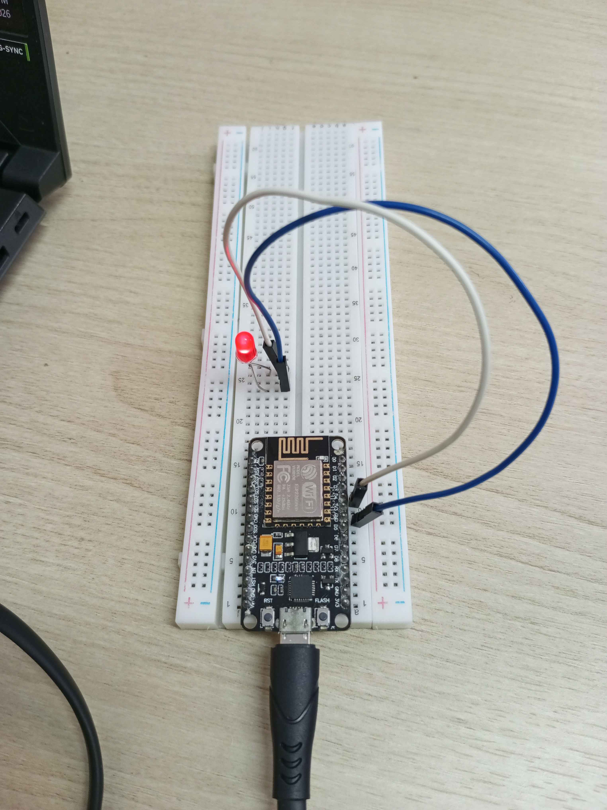
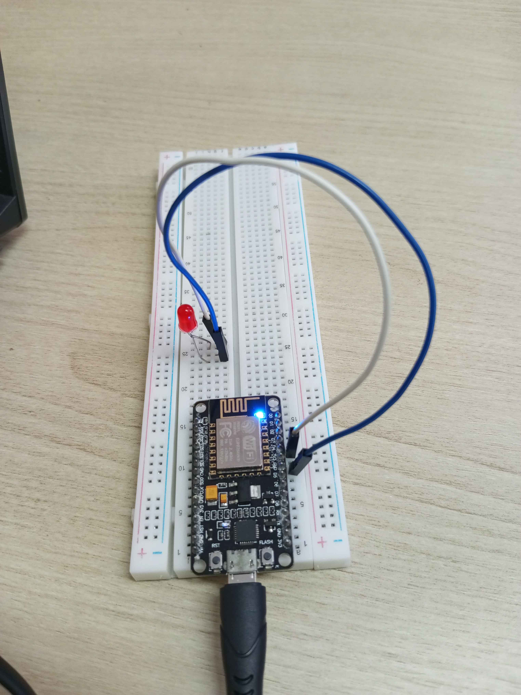
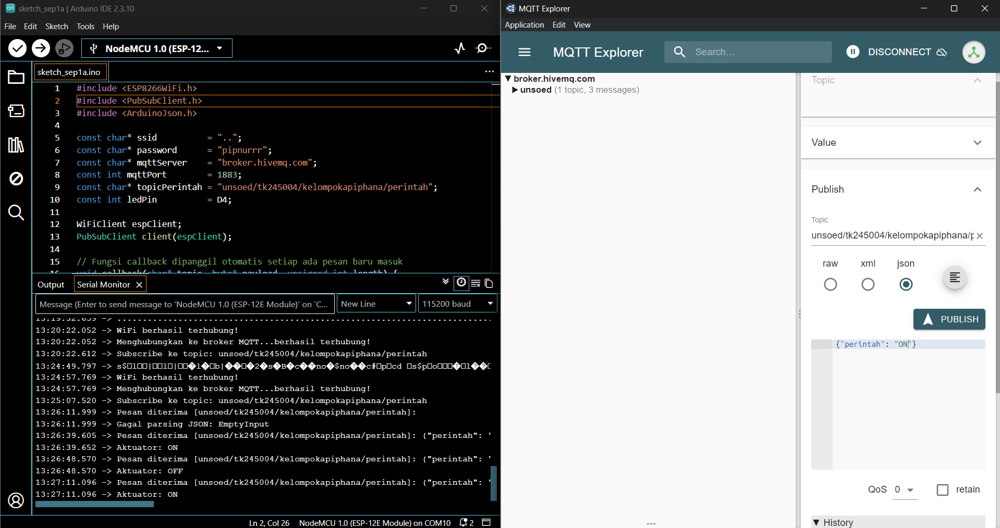
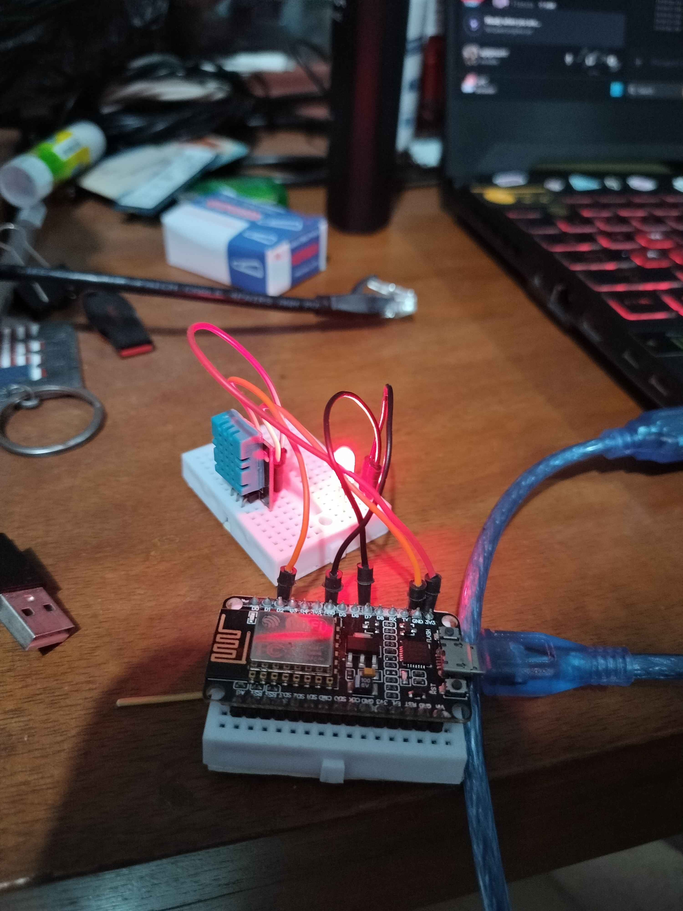
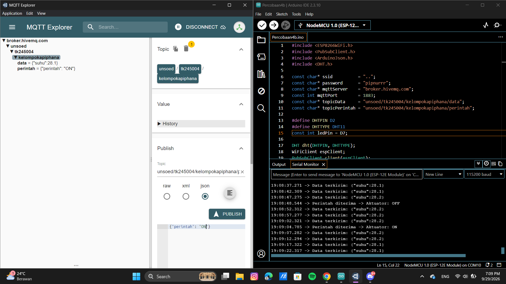
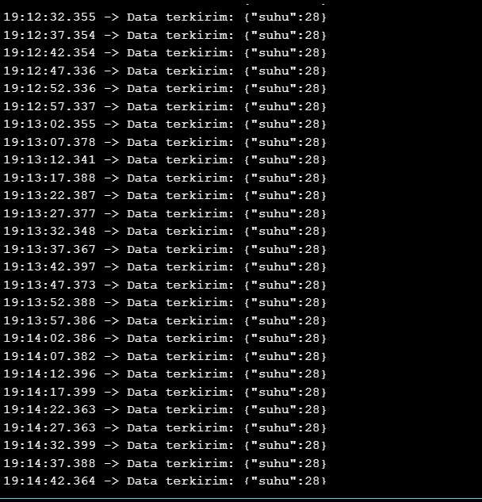

# Pertemuan 4 - Komunikasi Pertukaran Data

## Tujuan dan Penjelasan Singkat
Praktikum pada Pertemuan 4 ini berfokus pada implementasi komunikasi pertukaran data dua arah (bidirectional) pada sistem Internet of Things (IoT) menggunakan protokol MQTT:
1. Konsep Pertukaran Data Dua Arah: Memahami mekanisme pengiriman (Publish) data telemetri dan penerimaan (Subscribe) perintah secara simultan pada mikrokontroler.
2. Deserialisasi Data JSON: Memahami mekanisme penerimaan data dan proses membedah (deserialization) teks berformat JSON menjadi variabel yang dapat diproses oleh mikrokontroler.
3. Kendali Aktuator Real-Time: Mengimplementasikan penerimaan perintah kendali jarak jauh melalui pesan MQTT untuk mengontrol aktuator (LED) secara langsung.
4. Komunikasi Non-Blocking: Mengimplementasikan pengiriman data sensor secara berkala menggunakan fungsi millis() tanpa mengganggu penerimaan pesan kendali.   

## Peralatan yang Diperlukan
<div align="center">
<table border="1" cellpadding="10" cellspacing="0" width="100%">
  <tr align="center">
    <th>ESP8266</th>
    <th>Breadboard</th>
    <th>Kabel Jumper</th>
    <th>Sensor DHT11</th>
    <th>LED</th>
    <th>Kabel Micro USB</th>
    <th>Arduino IDE</th>
  </tr>

  <tr align="center">
    <td>
      <br>
    </td>
    <td>
      <br>
    </td>
    <td>
      <br>
    </td>
    <td>
      <br>
    </td>
    <td>
      <br>
    </td>
    <td>
      <br>
    </td>
    <td>
      <br>
    </td>
  </tr>
</table>
</div>

## Percobaan 4A
### Gambaran Umum 
Percobaan 4A bertujuan untuk mengimplementasikan fungsi penerimaan perintah kendali jarak jauh pada ESP8266 yang bertindak sebagai subscriber MQTT. ESP8266 terhubung ke broker broker.hivemq.com dan mendaftarkan pemesanan pada topik unsoed/tk245004/kelompokapiphana/perintah. Ketika terdapat pesan JSON baru yang masuk, fungsi callback() akan dipanggil secara otomatis untuk mendeserialisasi teks JSON menggunakan pustaka ArduinoJson. Nilai dari kunci "perintah" dibaca untuk menentukan status menyala (ON) atau mati (OFF) pada LED indikator yang terhubung ke pin D4.

### Skematik Percobaan
```
[ Broker MQTT (broker.hivemq.com:1883) ]
              │
    (Topic: .../perintah)
              │
              ▼
    [ ESP8266 (Subscriber) ]
              │
           (Pin D4)
              │
              ▼
      [ Anoda LED (+) ]
     [ Katoda LED (-) ] ─── [ Resistor 220Ω ] ─── [ GND ESP8266 ]
```

### Kode Program
```cpp
#include <ESP8266WiFi.h>
#include <PubSubClient.h>
#include <ArduinoJson.h>

const char* ssid          = "..";
const char* password      = "pipnurrr";
const char* mqttServer    = "broker.hivemq.com";
const int mqttPort        = 1883;
const char* topicPerintah = "unsoed/tk245004/kelompokapiphana/perintah";
const int ledPin          = D4;

WiFiClient espClient;
PubSubClient client(espClient);

// Fungsi callback dipanggil otomatis setiap ada pesan baru masuk
void callback(char* topic, byte* payload, unsigned int length) {
  String pesan;
  for (unsigned int i = 0; i < length; i++) {
    pesan += (char)payload[i];
  }
  Serial.print("Pesan diterima [");
  Serial.print(topic);
  Serial.print("]: ");
  Serial.println(pesan);

  // Deserialisasi data JSON yang diterima
  JsonDocument doc;
  DeserializationError error = deserializeJson(doc, pesan);

  if (error) {
    Serial.print("Gagal parsing JSON: ");
    Serial.println(error.c_str());
    return;
  }

  const char* perintah = doc["perintah"];
  if (String(perintah) == "ON") {
    digitalWrite(ledPin, HIGH);
    Serial.println("Aktuator: ON");
  } else if (String(perintah) == "OFF") {
    digitalWrite(ledPin, LOW);
    Serial.println("Aktuator: OFF");
  }
}

void hubungkanWiFi() {
  WiFi.begin(ssid, password);
  Serial.print("Menghubungkan ke WiFi");
  while (WiFi.status() != WL_CONNECTED) {
    delay(500);
    Serial.print(".");
  }
  Serial.println("\nWiFi berhasil terhubung!");
}

void hubungkanMQTT() {
  while (!client.connected()) {
    Serial.print("Menghubungkan ke broker MQTT...");
    String clientId = "ESP8266Client-" + String(random(0xffff), HEX);
    if (client.connect(clientId.c_str())) {
      Serial.println("berhasil terhubung!");
      client.subscribe(topicPerintah); // subscribe setelah berhasil terhubung
      Serial.print("Subscribe ke topic: ");
      Serial.println(topicPerintah);
    } else {
      Serial.print("gagal, rc=");
      Serial.print(client.state());
      Serial.println(" coba lagi dalam 2 detik");
      delay(2000);
    }
  }
}

void setup() {
  Serial.begin(115200);
  pinMode(ledPin, OUTPUT);
  digitalWrite(ledPin, LOW);
  hubungkanWiFi();
  client.setServer(mqttServer, mqttPort);
  client.setCallback(callback); // daftarkan fungsi callback
}

void loop() {
  if (!client.connected()) {
    hubungkanMQTT();
  }
  client.loop(); // wajib dipanggil terus-menerus agar pesan dapat diterima
}
```

### Penjelasan Kode per Baris Fungsi
1. `#include <ESP8266WiFi.h>, <PubSubClient.h>, <ArduinoJson.h>` : Mengimpor pustaka untuk penanganan jaringan WiFi, protokol komunikasi MQTT, dan pustaka manipulasi data format JSON.
2. `const char* topicPerintah = "..."` : Menentukan nama topik MQTT spesifik tempat ESP8266 mendengarkan instruksi kendali.
3. `const int ledPin = D4` : Menetapkan pin GPIO D4 sebagai jalur keluaran digital untuk mengendalikan LED.
4. `void callback(char* topic, byte* payload, unsigned int length) { ... }` : Fungsi penangan (callback) yang otomatis dipicu oleh pustaka PubSubClient saat pesan baru dari broker diterima.   
5. `String pesan; for (...) pesan += (char)payload[i];` : Membaca larik byte payload pesan dan mengonversinya menjadi objek string teks.
6. `DeserializationError error = deserializeJson(doc, pesan);` : Mendeserialisasi teks berformat JSON menjadi dokumen objek agar nilai kuncinya dapat diakses.
7. `if (error) { ... }` : Mengevaluasi keberhasilan proses parsing JSON dan menghentikan fungsi jika format data tidak valid.
8. `const char* perintah = doc["perintah"];` : Mengambil nilai atribut dari kunci "perintah" di dalam objek JSON.
9. `if (String(perintah) == "ON") ... else if (...)` : Mengatur logika sinyal digital pada pin LED berdasarkan nilai atribut perintah yang dibaca.
10. `void hubungkanWiFi()` : Mengelola prosedur negosiasi koneksi nirkabel ESP8266 ke jaringan router.
11. `void hubungkanMQTT()` : Mengelola proses re-koneksi ke broker MQTT dan mendaftarkan pemesanan topik via client.subscribe().
12. `void setup()` : Menginisialisasi komunikasi serial, mengatur mode pin LED, mengonfigurasi alamat server MQTT, dan meregistrasikan fungsi callback.
13. `void loop()` : Memeriksa keaktifan koneksi dan mengeksekusi client.loop() secara berkelanjutan agar pesan masuk dapat diproses secara responsif.   

### Library/Dependencies yang Dibutuhkan
1. ESP8266WiFi.h (Pustaka internal ESP8266 Core).
2. PubSubClient oleh Nick O'Leary.
3. ArduinoJson oleh Benoit Blanchon (versi 6/7).   

### Pertanyaan Praktikum
1. Gambarkan diagram alur (flowchart) proses penerimaan dan pemrosesan pesan pada fungsi callback di atas!
2. Apa yang akan terjadi apabila pesan yang dipublikasikan bukan merupakan format JSON yang valid?
3. Jelaskan mengapa fungsi client.subscribe() dipanggil di dalam fungsi hubungkanMQTT(), bukan di dalam setup()!
4. Modifikasi program agar data JSON yang diterima juga memuat nilai intensitas (misalnya {"perintah": "ON", "intensitas": 200}) yang digunakan untuk mengatur kecerahan LED menggunakan PWM (analogWrite/ledcWrite), dan berikan penjelasan di setiap baris kode yang ditambahkan dalam bentuk README.md

### Jawaban Praktikum
1. Diagram Alur (Flowchart) Penerimaan dan Pemrosesan Pesan Pada Fungsi Callback
<div align="center">
  
</div>

2. Apabila pesan yang dipublikasikan bukan format JSON yang valid, fungsi deserializeJson(doc, pesan) akan menghasilkan galat (DeserializationError). Program mengeksekusi blok if (error) dengan mencetak pesan kesalahan ke Serial Monitor, lalu menjalankan perintah return. Akibatnya, pemrosesan perintah dihentikan secara prematur dan status pin LED tidak akan mengalami perubahan.
3. Fungsi setup() hanya dieksekusi satu kali saat mikrokontroler pertama kali menyala. Apabila koneksi MQTT terputus di tengah jalan dan melakukan re-koneksi pada loop(), pendaftaran subscribe akan hilang di sisi broker. Memanggil client.subscribe() di dalam hubungkanMQTT() memastikan bahwa ESP8266 secara otomatis melakukan pendaftaran ulang (resubscribe) ke topik sasaran setiap kali berhasil terhubung kembali ke broker.
4. Kode Modifikasi
```cpp
// Kode Fungsi Callback Hasil Modifikasi
void callback(char* topic, byte* payload, unsigned int length) {
  String pesan;
  for (unsigned int i = 0; i < length; i++) {
    pesan += (char)payload[i];
  }
  Serial.print("Pesan diterima [");
  Serial.print(topic);
  Serial.print("]: ");
  Serial.println(pesan);

  JsonDocument doc;
  DeserializationError error = deserializeJson(doc, pesan);

  if (error) {
    Serial.print("Gagal parsing JSON: ");
    Serial.println(error.c_str());
    return;
  }

  const char* perintah = doc["perintah"];
  int intensitas = doc["intensitas"] | 0; // Modifikasi: Membaca nilai intensitas PWM

  if (String(perintah) == "ON") {
    analogWrite(ledPin, intensitas); // Modifikasi: Mengatur kecerahan LED via PWM
    Serial.print("Aktuator: ON | Intensitas PWM: ");
    Serial.println(intensitas);
  } else if (String(perintah) == "OFF") {
    analogWrite(ledPin, 0); // Modifikasi: Mematikan LED (PWM 0)
    Serial.println("Aktuator: OFF");
  }
}
```

#### Penjelasan Baris Kode Modifikasi:
- `int intensitas = doc["intensitas"] | 0;` : Membaca nilai dari kunci "intensitas" pada dokumen JSON. Penggunaan operator | 0 berfungsi memberikan nilai default 0 apabila kunci tersebut tidak ada di dalam payload JSON.
- `analogWrite(ledPin, intensitas);` : Mengganti fungsi sakelar digital (digitalWrite) menjadi sinyal PWM (Pulse Width Modulation) untuk mengatur tingkat kecerahan LED secara bertahap berdasarkan nilai variabel intensitas (rentang 0–1023 pada ESP8266).
- `Serial.print("Aktuator: ON | Intensitas PWM: "); Serial.println(intensitas);` : Mencetak konfirmasi status LED aktif beserta tingkat nilai intensitas PWM yang diterapkan ke Serial Monitor.
- `analogWrite(ledPin, 0);` : Mengirimkan sinyal PWM bernilai 0 ke pin LED untuk mematikan LED secara penuh saat instruksi "OFF" diterima.

### Dokumentasi
<div align="center">
<table border="1" cellpadding="10" cellspacing="0" width="100%">
    <td>
      <br>
    </td>
    <td>
      <br>
    </td>
    <td>
      <br>
    </td>
  </tr>
</table>
</div>

## Percobaan 4B
### Gambaran Umum 
Percobaan 4B mengimplementasikan komunikasi pertukaran data dua arah secara simultan (Full-Duplex / Bidirectional) pada ESP8266. Perangkat berfungsi ganda: mempublikasikan data telemetri suhu dari sensor DHT11 ke topik unsoed/tk245004/kelompokapiphana/data secara periodik setiap 5 detik, serta mendengarkan topik unsoed/tk245004/kelompokapiphana/perintah untuk penerimaan instruksi kendali LED. Agar proses penerimaan perintah tidak terhambat (lag), pengiriman data sensor diatur menggunakan pendekatan non-blocking dengan fungsi millis() sebagai pengganti delay().

### Skematik Percobaan
```
                [ Broker MQTT (broker.hivemq.com:1883) ]
                        ▲                       │
     (Topic: .../data)  │                       │ (Topic: .../perintah)
     Publish (Sensor)   │                       ▼ Subscribe (Kendali)
             ┌──────────┴───────────────────────┴──────────┐
             │              ESP8266 NodeMCU                │
             └──────────┬───────────────────────┬──────────┘
                        │ (Pin D2)              │ (Pin D4)
                        ▼                       ▼
                  [ Sensor DHT11 ]        [ Aktuator LED ]
```

### Kode Program
```cpp
#include <ESP8266WiFi.h>
#include <PubSubClient.h>
#include <ArduinoJson.h>
#include <DHT.h>

const char* ssid          = "..";
const char* password      = "pipnurrr";
const char* mqttServer    = "broker.hivemq.com";
const int mqttPort        = 1883;
const char* topicData     = "unsoed/tk245004/kelompokapiphana/data";
const char* topicPerintah = "unsoed/tk245004/kelompokapiphana/perintah";

#define DHTPIN D2
#define DHTTYPE DHT11
const int ledPin = D4;

DHT dht(DHTPIN, DHTTYPE);
WiFiClient espClient;
PubSubClient client(espClient);

unsigned long waktuTerakhirPublish = 0;
const long intervalPublish = 5000; // kirim data tiap 5 detik (non-blocking)

void callback(char* topic, byte* payload, unsigned int length) {
  String pesan;
  for (unsigned int i = 0; i < length; i++) pesan += (char)payload[i];

  JsonDocument doc;
  if (deserializeJson(doc, pesan)) return; // abaikan bila format json error

  const char* perintah = doc["perintah"];
  digitalWrite(ledPin, String(perintah) == "ON" ? HIGH : LOW);
  Serial.print("Perintah diterima -> Aktuator: ");
  Serial.println(perintah);
}

void hubungkanWiFi() {
  WiFi.begin(ssid, password);
  while (WiFi.status() != WL_CONNECTED) delay(500);
  Serial.println("WiFi berhasil terhubung!");
}

void hubungkanMQTT() {
  while (!client.connected()) {
    String clientId = "ESP8266Client-" + String(random(0xffff), HEX);
    if (client.connect(clientId.c_str())) {
      client.subscribe(topicPerintah);
      Serial.println("Terhubung dan subscribe topic perintah");
    } else {
      delay(2000);
    }
  }
}

void setup() {
  Serial.begin(115200);
  pinMode(ledPin, OUTPUT);
  dht.begin();
  hubungkanWiFi();
  client.setServer(mqttServer, mqttPort);
  client.setCallback(callback);
}

void loop() {
  if (!client.connected()) hubungkanMQTT();
  client.loop(); // memproses pesan masuk terus menerus

  // Kirim data sensor berkala tanpa memblokir callback
  if (millis() - waktuTerakhirPublish > intervalPublish) {
    waktuTerakhirPublish = millis();
    float suhu = dht.readTemperature();
    if (!isnan(suhu)) {
      JsonDocument doc;
      doc["suhu"] = suhu;
      char buffer[128];
      serializeJson(doc, buffer);
      client.publish(topicData, buffer);
      Serial.print("Data terkirim: ");
      Serial.println(buffer);
    }
  }
}
```

### Penjelasan Kode per Baris Fungsi
1. `#include <DHT.h>` : Mengimpor pustaka pengoperasian sensor suhu dan kelembaban DHT11.
2. `const char* topicData & topicPerintah` : Deklarasi dua nama topik MQTT terpisah untuk pengiriman telemetri (publish) dan penerimaan perintah (subscribe).
3. `#define DHTPIN D2 & #define DHTTYPE DHT11` : Konfigurasi pin D2 sebagai jalur data sensor DHT11.
4. `unsigned long waktuTerakhirPublish = 0` : Variabel pewaktu untuk menyimpan rekam waktu panggilan fungsi publish terakhir.
5. `const long intervalPublish = 5000` : Batas jeda waktu antar pengiriman data telemetri sebesar 5000 milidetik (5 detik).
6. `digitalWrite(ledPin, String(perintah) == "ON" ? HIGH : LOW)` : Penggunaan operator ternary untuk menyederhanakan ekspresi logika eksekusi pin LED berdasarkan kata kunci perintah.
7. `if (millis() - waktuTerakhirPublish > intervalPublish)` : Mekanisme pewaktuan non-blocking yang membandingkan selisih waktu berjalan dengan interval tanpa menghentikan eksekusi utama program.   
8. `float suhu = dht.readTemperature(); if (!isnan(suhu))` : Membaca suhu dari sensor DHT11 dan menguji keabsahan nilai numeriknya.
9. `client.publish(topicData, buffer)` : Mengirimkan string JSON berisi nilai data suhu ke topik telemetri.

### Library/Dependencies yang Dibutuhkan
1. ESP8266WiFi.h (Pustaka internal ESP8266 Core).
2. PubSubClient oleh Nick O'Leary.
3. ArduinoJson oleh Benoit Blanchon (versi 6/7).
4. DHT sensor library oleh Adafruit.
5. Adafruit Unified Sensor oleh Adafruit.

### Pertanyaan Praktikum
1. Mengapa penggunaan delay() yang lama sebaiknya dihindari pada program yang menggabungkan proses publish dan subscribe secara bersamaan?
2. Jelaskan cara kerja mekanisme non-blocking menggunakan fungsi millis() pada program di atas!
3. Apa yang akan terjadi apabila fungsi client.loop() jarang dipanggil (misalnya hanya sekali setiap 10 detik)?
4. Modifikasi program agar menambahkan satu topic perintah baru untuk mengendalikan aktuator kedua (misalnya buzzer), dengan fungsi callback yang dapat membedakan topic mana yang menerima pesan, dan berikan penjelasan di setiap baris kode yang ditambahkan dalam bentuk README.md!


### Jawaban Praktikum
1. Fungsi delay() bersifat blocking (menghentikan seluruh eksekusi program). Penggunaan delay() yang lama akan menahan pemanggilan client.loop(), sehingga pesan perintah yang dikirim dari broker tidak dapat diproses secara real-time. Selain itu, broker dapat menganggap perangkat mati (timeout) dan memutuskan koneksi karena paket keep-alive (PINGREQ) terlambat dikirim.
2. Fungsi millis() mengembalikan durasi waktu (milidetik) yang telah berlalu sejak program mulai berjalan. Program menyimpan penanda waktu terakhir pada waktuTerakhirPublish. Setiap kali loop() berjalan, program mengevaluasi selisih millis() - waktuTerakhirPublish. Jika selisih telah mencapai 5000 ms, data dipublish dan penanda waktu diperbarui. Jika belum, loop() langsung berlanjut mengeksekusi client.loop(), sehingga penerimaan pesan tetap berjalan mulus tanpa interupsi.
3. Dampak jika client.loop() jarang dipanggil yaitu
    - Respon Terlambat: Eksekusi callback pesan baru akan tertunda (latensi tinggi), hanya diproses setiap kali client.loop() dipanggil.   
    - Koneksi Terputus: Broker MQTT akan memutuskan koneksi TCP secara otomatis karena tidak menerima sinyal keep-alive dalam rentang waktu yang ditentukan (keep-alive interval).
4. Modifikasi Program
```cpp
// 1. Deklarasi Tambahan Variabel Global
const char* topicBuzzer = "unsoed/tk245004/kelompokapiphana/buzzer";
const int buzzerPin     = D5;

// 2. Modifikasi Fungsi callback()
void callback(char* topic, byte* payload, unsigned int length) {
  String pesan;
  for (unsigned int i = 0; i < length; i++) pesan += (char)payload[i];

  JsonDocument doc;
  if (deserializeJson(doc, pesan)) return;

  const char* perintah = doc["perintah"];

  // Pengecekan topic asal pesan
  if (String(topic) == topicPerintah) {
    digitalWrite(ledPin, String(perintah) == "ON" ? HIGH : LOW);
    Serial.print("Perintah LED diterima -> ");
    Serial.println(perintah);
  } else if (String(topic) == topicBuzzer) {
    digitalWrite(buzzerPin, String(perintah) == "ON" ? HIGH : LOW);
    Serial.print("Perintah Buzzer diterima -> ");
    Serial.println(perintah);
  }
}

// 3. Modifikasi Fungsi hubungkanMQTT()
void hubungkanMQTT() {
  while (!client.connected()) {
    String clientId = "ESP8266Client-" + String(random(0xffff), HEX);
    if (client.connect(clientId.c_str())) {
      client.subscribe(topicPerintah);
      client.subscribe(topicBuzzer); // Subscribe ke topic buzzer
      Serial.println("Terhubung dan subscribe topic perintah & buzzer");
    } else {
      delay(2000);
    }
  }
}

// 4. Modifikasi Fungsi setup()
void setup() {
  Serial.begin(115200);
  pinMode(ledPin, OUTPUT);
  pinMode(buzzerPin, OUTPUT); // Inisialisasi pin buzzer
  digitalWrite(buzzerPin, LOW);
  dht.begin();
  hubungkanWiFi();
  client.setServer(mqttServer, mqttPort);
  client.setCallback(callback);
}
```

#### Penjelasan Baris Kode Modifikasi:
- `const char* topicBuzzer & const int buzzerPin = D5;` : Mendaftarkan variabel global baru untuk menyimpan nama topic MQTT khusus buzzer serta menetapkan pin GPIO D5 sebagai jalur keluaran ke buzzer.
- `if (String(topic) == topicPerintah) ... else if (String(topic) == topicBuzzer)` : Menambahkan pengecekan nama topic asal pesan di dalam fungsi callback() agar mikrokontroler dapat membedakan mana instruksi untuk LED dan mana instruksi untuk buzzer.
- `digitalWrite(buzzerPin, String(perintah) == "ON" ? HIGH : LOW);` : Mengatur status sinyal keluaran digital pada pin buzzer (HIGH/LOW) sesuai dengan nilai perintah "ON" atau "OFF".
- `client.subscribe(topicBuzzer);` : Mendaftarkan pemesanan (subscribe) ke topic buzzer pada broker MQTT di dalam fungsi hubungkanMQTT() agar pesan baru pada topic tersebut dapat diterima.
- `pinMode(buzzerPin, OUTPUT); digitalWrite(buzzerPin, LOW);` : Mengonfigurasi pin D5 sebagai output digital serta memastikan kondisi awal buzzer mati (LOW) saat awal eksekusi setup().

### Dokumentasi
<div align="center">
<table border="1" cellpadding="10" cellspacing="0" width="100%">
    <td>
      <br>
    </td>
    <td>
      <br>
    </td>
    <td>
      <br>
    </td>
  </tr>
</table>
</div>